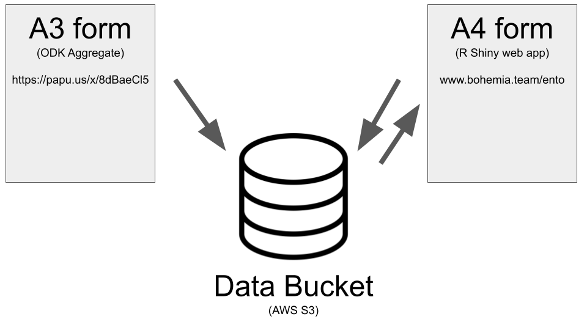

# The entomology (ento) data management tool

## Overview

Pending

## Software installation

- For forms A1, A2 and A3, refer to the [ODK data collection guide](https://github.com/databrew/bohemia/blob/master/guides/guide_data_collection_odk.md)  
- Form A4 consists of a custom-made shiny application: https://github.com/databrew/bohemia/tree/master/rpackage/ento#ento

## Data flow

