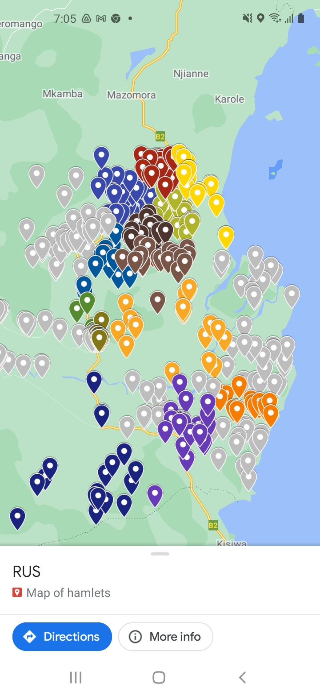
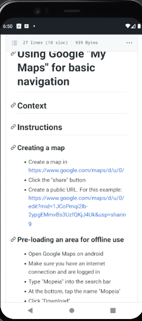

# Using Google "My Maps" for basic navigation

## Context

## Instructions

### Creating a map

- Create a map in https://www.google.com/maps/d/u/0/
- Click the "share" button
- Create a public URL. For this example: https://www.google.com/maps/d/u/0/edit?mid=1JCoPmqi2lb-2ypgEMmvBs3UzfQKjJ4Uk&usp=sharing

### Pre-loading an area for offline use

- Open Google Maps on android
- Make sure you have an internet connection and are logged in
- Type "Mopeia" into the search bar
- At the bottom, tap the name "Mopeia"
- Click "Download"
- Zoom out to the whole study area

### Use in the field

- Navigate to [THIS PAGE](https://github.com/databrew/bohemia/blob/master/guides/guide_google_maps.md) on the phone web browser.
- Click the link to the public URL of the map: https://www.google.com/maps/d/u/0/edit?mid=1JCoPmqi2lb-2ypgEMmvBs3UzfQKjJ4Uk&usp=sharing

- Make sure to save the link on the device for offline access (as a favorite, homescreen menu item, etc.)
- You can now navigate from place to place, see all locations, click on a location for information, etc.

