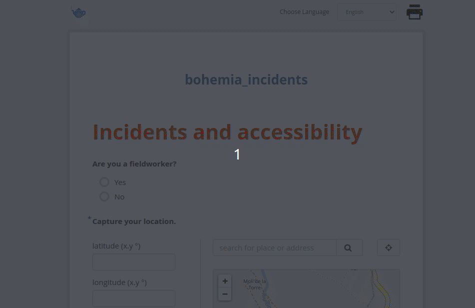

# How to enter "incidents" data

There exists a simple form for registering "incidents". This form is intended for use by anyone invovled in the Bohemia project - fieldworkers, social science staff, supervisors, researchers, etc. It can be accessed via any web browser (including on the phone) or, for offline use, via an android app.

## Access via web

Go to https://papu.us/x/CZXxut6b. Fill out the form. Click submit.

## Access via android application

The form in the android application is identical to the form in the above web url. However, fieldworkers may choose to use the android application because (a) they already have ODKCollect on their devices (since it is used for other data collection) and (b) it is optimized for offline data collection (ie, they can register multiple incidents and locations without internet connectivity, and upload later in batch).

In order to do this, one needs to install the ODKCollect app and load the "incidents" form. Below are instructions for the whole process (<5 minutes).

### Software installation

- Fetch an android device (phone/tablet)
- Download/Install [ODKCollect via Google Play](https://play.google.com/store/apps/details?id=org.odk.collect.android&hl=en)

### Setting up fieldworker credentials  

#### Credentials

- Use the below credentials.
  - Username: data
  - Password: data

#### Set up ODKCollect

- Open ODKCollect
- Click the three dots in the upper-right hand corner
- Select "General Settings"
- Click "Server"
- Change the server URL to https://bohemia.systems
- Set the credentials to `data` (user) and `data` (password)

### Synchronizing ODKCollect

- In ODKCollect, select "Get Blank Form"
- Select "incidents"
- Click "Get Selected"

### Filling out the form form
- In ODKCollect, on the main page, click the top button ("Fill Blank Form")
- Select "incidents"
- Begin filling out form
- To switch language, click the three dots in the upper right
- Go question by question filling out the form
- Click the "Save Form and Exit" button

### Sending data
- With an internet connection, from the main page of ODKCollect, click "Send Finalized Form"
- Select all and "Send"
