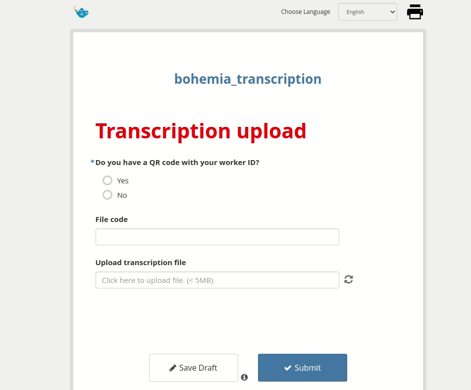

# How to upload audio transcriptions data

Audio is captured in social science focus group discussions and interviews. Transcriptions are written copies of this audio. The Bohemia project requires that transcriptions be saved centrally, and be linkable to information about the transcription (such as the date, fieldworker, location, etc.).

Each site will have its own SOP regarding how to handle audio files and transcriptions, so as to ensure that files are approriately saved, and deleted (when the time comes). This guide does not cover site-specific SOPs, but rather provides an overview for the mechanism for transferring transcriptions from sites to the sponsor database.

## Access via web

It is expected that transcriptions will be saved on a computer as a `.doc` or `.docx` file, and then uploaded. Upload can be carried out at https://papu.us/x/NgXNXmj0. One should fill out the form, attach the file, and upload.

## Tracking uploads

Once the above form is finalized, and site-specific SOPs have been generated, a simple dashboard with transcription meta-information will be made available. This dashboard will include:
- number of uploads
- date/times of uploads
- uploads by person
- list of filenames uploaded

The primary purpose of this dashboard will be to allow for reconciliation between (a) local sites' list of files and (b) the list of uploaded files, so as to ensure that they are identical. A secondary purpose of the dashboard will be operational monitoring.
